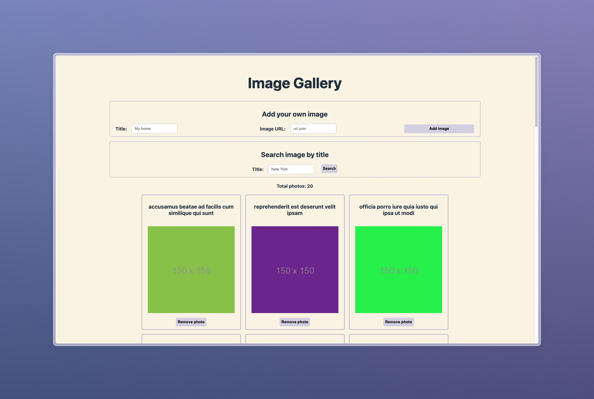

# Image Gallery

Image Gallery is a web application built using React, designed to provide users with a seamless experience in managing and viewing images. This project leverages modern web technologies to offer features such as uploading images, searching through the gallery, and deleting images.

## Live Demo
You can view the live demo [here](https://dummy-image-gallery.netlify.app/).

## Features

- **Upload Images**: Users can upload images to the gallery.
- **View Images**: A dynamic and responsive gallery to view all uploaded images.
- **Search Images**: Users can search for images using keywords.
- **Delete Images**: Allows users to delete images from the gallery.

## Technologies Used

- **React**: For building the user interface.
- **Vite**: As the build tool for a faster development experience.
